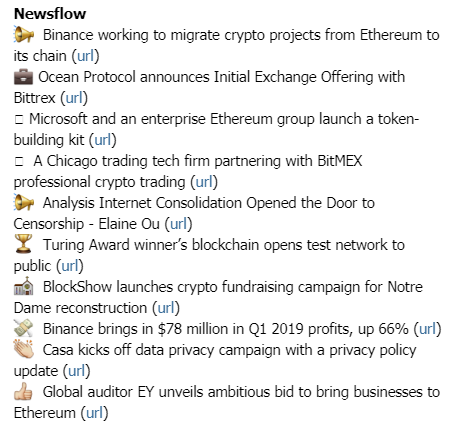

+++
# Date this page was created.
date = "2018-01-01"

# Project title.
title = "Blockchain & Cryptoasset Analytics"

# Project summary to display on homepage.
summary = "This project develops an intelligent data driven application to monitor blockchain projects and to analyze cryptoassets from both utility and speculation perspectives. We target blockchain entrepreneurs, investors and traders all along the life of projects: token generation, listing on secondary market, product delivery, product usage, and token valorization."

# Optional image to display on homepage (relative to `static/img/` folder).
image_preview = "webapp.jpg"

# Tags: can be used for filtering projects.
tags = ["blockchain-cryptoasset", "quantitative-analytics"]

# Optional external URL for project (replaces project detail page).
external_link = ""

# Does the project detail page use math formatting?
math = false

# Optional featured image (relative to `static/img/` folder).
[header]
image = ""
caption = ""

# Featured image
# To use, add an image named `featured.jpg/png` to your project's folder. 
[image]
  # Caption (optional)
  caption = ""

  # Focal point (optional)
  # Options: Smart, Center, TopLeft, Top, TopRight, Left, Right, BottomLeft, Bottom, BottomRight
  focal_point = ""

  # Show image only in page previews?
  preview_only = true

+++

This project develops an intelligent data driven application to monitor blockchain projects and to analyze cryptoassets from both utility and speculation perspectives. We target blockchain entrepreneurs, investors and traders all along the life of projects: token generation, listing on secondary market, product delivery, product usage, and token valorization.

Homepage:

- English: [https://kenhtaichinh.herokuapp.com](https://kenhtaichinh.herokuapp.com)

- Vietnamese: [https://tapchitienmahoa.github.io](https://tapchitienmahoa.github.io)

## Data-Driven Analytics

### Altcoin price versus supply analysis

### Market movement statistics and heatmap

### Bitcoin aggregated statistics

### Newsflow sentiment analysis

## Advanced Trading Strategies

### Portfolio management and optimization

### Iceberg order and beyond
