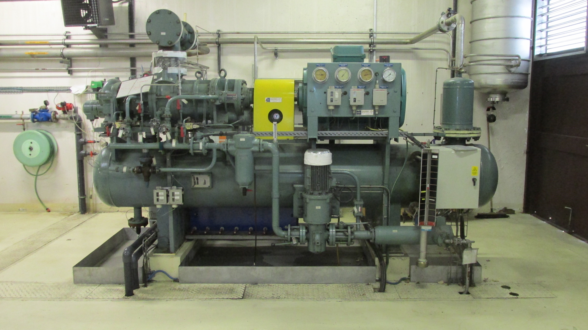
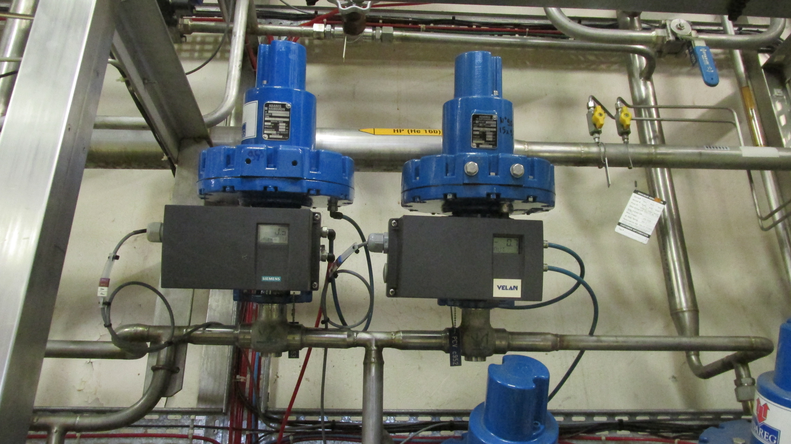
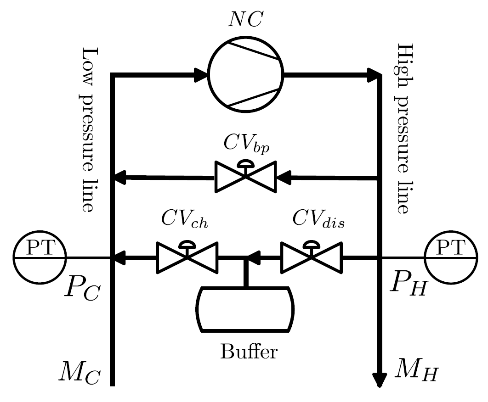
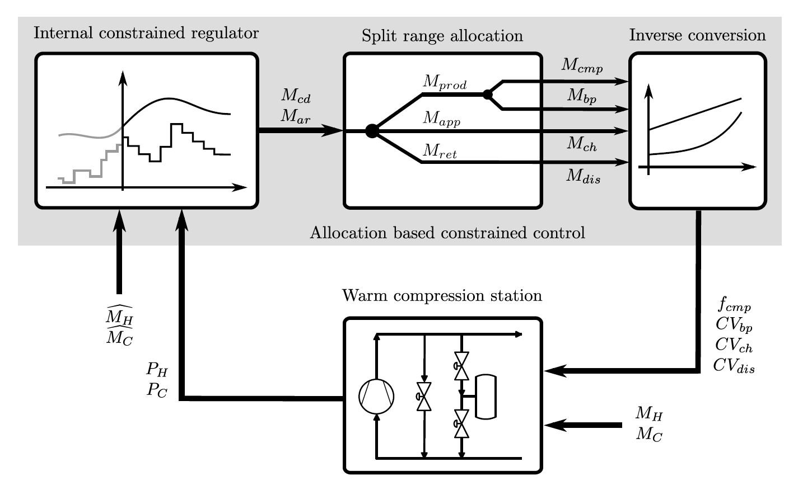
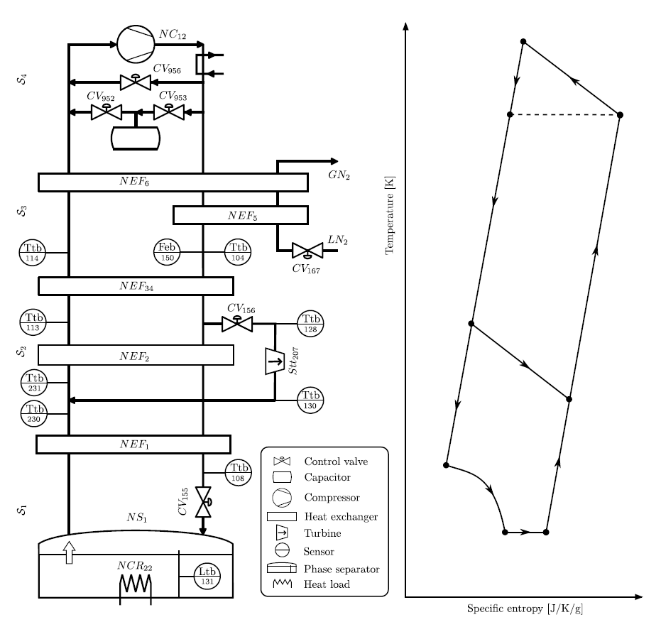
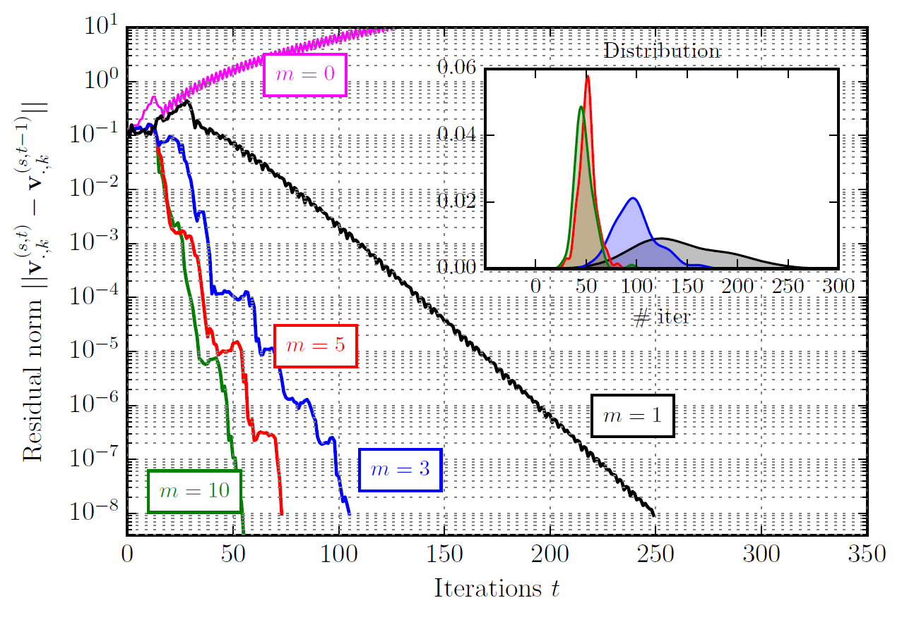
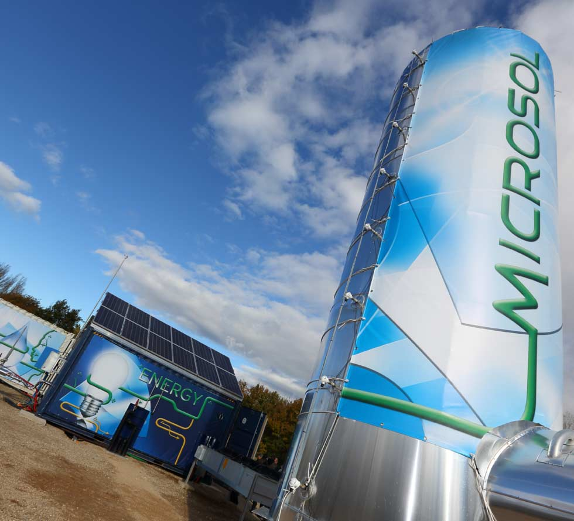
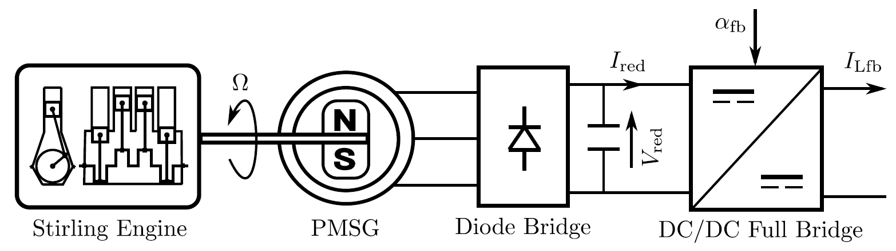
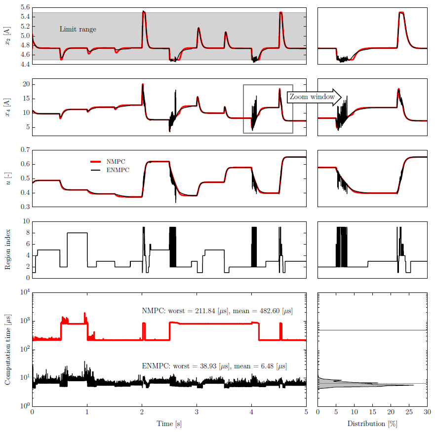

+++
# Date this page was created.
date = "2018-01-01"

# Project title.
title = "Innovative Advanced Control of Large Cryogenic Systems"

# Project summary to display on homepage.
summary = "The ANR CRYOGREEN project gathers collaborative academic and industrial partners, including GIPSA-lab, CEA and CERN. We target to advanced control of large cryogenic systems via explicit nonlinear and hierarchical distributed model predictive control frameworks."

# Optional image to display on homepage (relative to `static/img/` folder).
image_preview = ""

# Tags: can be used for filtering projects.
tags = ["optimization-control", "model-predictive-control", "cryogenics", "thermodynamics"]

# Optional external URL for project (replaces project detail page).
external_link = ""

# Does the project detail page use math formatting?
math = false

# Optional featured image (relative to `static/img/` folder).
[header]
image = ""
caption = ""

# Featured image
# To use, add an image named `featured.jpg/png` to your project's folder. 
[image]
  # Caption (optional)
  caption = ""

  # Focal point (optional)
  # Options: Smart, Center, TopLeft, Top, TopRight, Left, Right, BottomLeft, Bottom, BottomRight
  focal_point = ""

  # Show image only in page previews?
  preview_only = true

+++

The ANR CRYOGREEN project gathers collaborative academic and industrial partners, including GIPSA-lab, CEA and CERN. We target to advanced control of large cryogenic systems via explicit nonlinear and hierarchical distributed model predictive control frameworks.



## Explicit Constrained Control of Warm Compression Stations

### Process configuration and dynamic simulator

### Allocation control and validation results

## Hierarchical Constrained Control of Cryogenic Refrigerators

### Process diagram and dynamic simulator

### Hierarchical control algorithm and numerical results

## Fast nonlinear constrained control of a Stirling engine

### Process diagram

### Fast explicit constrained control synthesis

### Real-time validation

