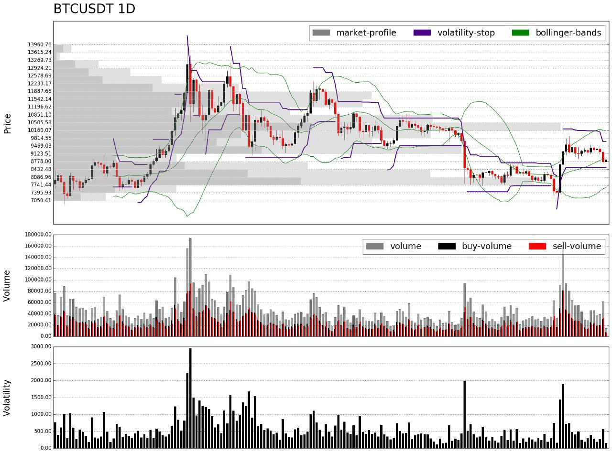
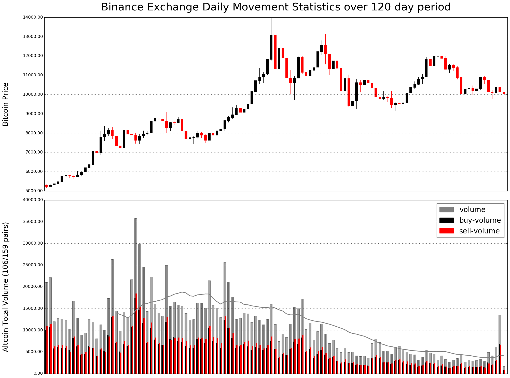
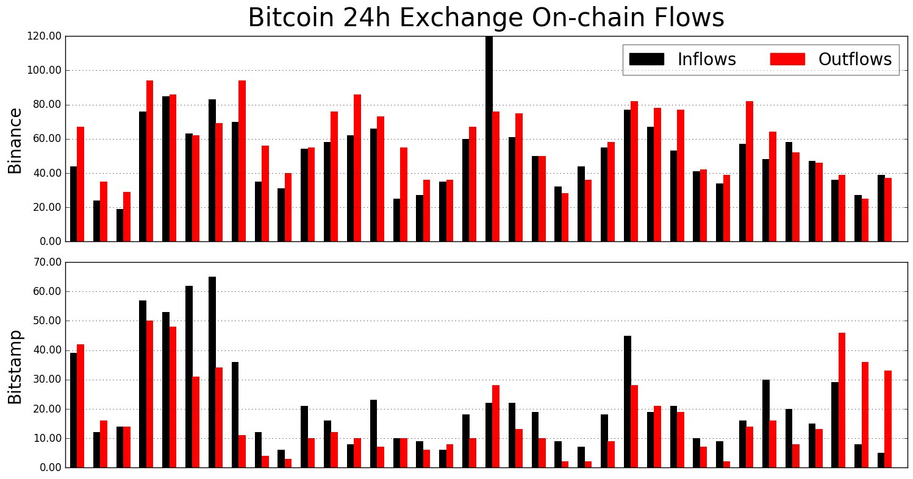

+++
# Date this page was created.
date = "2018-01-01"

# Project title.
title = "Quantitative Analytics and Trading Strategies"

# Project summary to display on homepage.
summary = ""
<!-- summary = "This project develops an intelligent data driven application to monitor blockchain projects and to analyze cryptoassets from both utility and speculation perspectives." -->

# Optional image to display on homepage (relative to `static/img/` folder).
image_preview = ""

# Tags: can be used for filtering projects.
tags = ["blockchain-cryptoasset", "data-analytics"]

# Optional external URL for project (replaces project detail page).
external_link = ""

# Does the project detail page use math formatting?
math = false

# Optional featured image (relative to `static/img/` folder).
[header]
image = ""
caption = ""

# Featured image
# To use, add an image named `featured.jpg/png` to your project's folder. 
[image]
  # Caption (optional)
  caption = ""

  # Focal point (optional)
  # Options: Smart, Center, TopLeft, Top, TopRight, Left, Right, BottomLeft, Bottom, BottomRight
  focal_point = ""

  # Show image only in page previews?
  preview_only = true

+++

This project develops an intelligent data driven application to monitor blockchain projects and to analyze cryptoassets from both utility and speculation perspectives. We target blockchain entrepreneurs, investors and traders all along the life of projects: token generation, listing on secondary market, product delivery, product usage, and token valorization.

## Financial Data Analytics

### Crypto Markets

#### Fundamental information

```
#EVX
Type: TOKEN
Consensus Protocol: POW
Cryptographic Algorithm: Ethash
Website: https://www.everex.io/
Social Media: 
https://t.me/everexio
https://www.facebook.com/everex.io
https://twitter.com/everexio
Explorers: 
https://etherscan.io/token/0xf3db5fa2c66b7af3eb0c0b782510816cbe4813b8
Market Cap: $10,694,046
Current Price: $0.473188
Issue Price: $0.880000
Issue Date: 2017-10-11
Max Supply: -
Total Supply: 25,000,000
Circulating Supply: 22,600,000
```

#### Short-term transactions

```
#TNTBTC 92,966,054.00 (94.84%)
P: 0.00000730 V: 608.23 VWAP: 0.00000654
30 mins: Buy 12.07 Sell 6.42
15 mins: Buy 8.37 Sell 3.97
5 mins: Buy 4.19 Sell 2.16
#TNTETH 5,059,783.00 (5.16%)
P: 0.00026182 V: 1,194.92 VWAP: 0.00023616
30 mins: Buy 13.32 Sell 12.58
15 mins: Buy 8.04 Sell 2.38
5 mins: Buy 1.76 Sell 1.99
```

#### Technical analysis



#### Market movement statistics

```
#MARKET
USDⓈ: 20 (+) 113 (-)
ALTS: 43 (+) 89 (-)
BNB: 63 (+) 30 (-)
BTC: 120 (+) 31 (-)
Tue Jul  2 13:48:21 2019
```

#### Altcoin market money flows



#### On-chain exchange flows

```
*Daily BTC exchange flows*
#Binance: $75M in | $68M out
#Bitmex: $18M in | $7M out
#Bitfinex: $6M in | $8M out
#Bitstamp: $18M in | $22M out
#Bittrex: $2M in | $4M out
#Poloniex: $1M in | $2M out

*Daily ETH exchange flows*
#Binance: $24M in | $12M out
#Bitfinex: $2M in | $1M out
#Bittrex: $240k in | $415k out
#Kraken: $2M in | $2M out
#Kucoin: $406k in | $235k out
#Poloniex: $325k in | $352k out

*Weekly BTC exchange flows*
Inflow: $703.8M (-42.1% from last week)
Outflow: $763.5M (-27.8% from last week)
Net flow: -$59.7M
#BTC price: $8084.63 (-1.3% from last week)

*Weekly ETH exchange flows*
Inflow: $119.1M (-37.5% from last week)
Outflow: $111.8M (-48.7% from last week)
Net flow: $7.3M
#ETH price: $175.74 (+0.8% from last week)

*Weekly Stablecoin exchange flows*
Inflow: $264.3M (-51.1% from last week)
Outflow: $364.0M (-45.7% from last week)
Net flow: -$99.7M
```



#### Transaction activities

```
*Transaction activities*
2019-10-12: :dollar:  2,500,000 #USDT (2,494,282 USD) minted at Tether Treasury
2019-10-12: :dollar:  5,000,000 #USDT (5,012,230 USD) minted at Tether Treasury
2019-10-11: :dollar: :dollar:  15,000,000 #USDT (15,077,725 USD) minted at Tether Treasury
2019-10-10: :dollar: :dollar: :dollar:  20,000,000 #USDT (20,002,176 USD) minted at Tether Treasury
2019-10-07: :dollar: :dollar:  12,387,600 #USDT (12,392,934 USD) minted at Tether Treasury
2019-10-07: :dollar: :dollar:  20,000,000 #USDT (19,952,765 USD) minted at Tether Treasury
2019-10-04: :dollar: :dollar:  12,600,000 #USDT (12,725,111 USD) minted at Tether Treasury
2019-10-04: :dollar:  5,000,000 USDT (5,035,628 USD) minted at Tether Treasury
2019-09-30: :dollar: :dollar:  20,000,000 #USDT (19,996,690 USD) minted at Tether Treasury
```

#### Newsflow


### Crypto Derivatives 

#### Basis

#### Funding rate

#### Open interest

## Trading Strategies

### Position sizing and leverage

### Pairs trading

## Web Application


