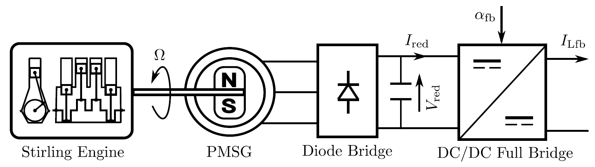
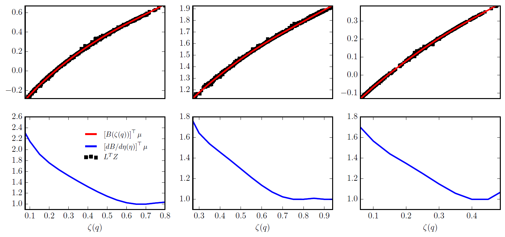

+++
# Date this page was created.
date = "2018-01-01"

# Project title.
title = "Innovative Solar Micro Power Plant"

# Project summary to display on homepage.
summary = "MICROSOL is a research & collaborative project bringing tocheter labs, industrial companies and innovative start-ups. Solar power plant are designed to produce heat, electricity and optionally pure water for off-grid infrastructures."

# Optional image to display on homepage (relative to `static/img/` folder).
image_preview = ""

# Tags: can be used for filtering projects.
tags = ["optimization-control", "model-predictive-control", "solar-energy", "industrial-automation"]

# Optional external URL for project (replaces project detail page).
external_link = ""

# Does the project detail page use math formatting?
math = false

# Optional featured image (relative to `static/img/` folder).
[header]
image = ""
caption = ""

# Featured image
# To use, add an image named `featured.jpg/png` to your project's folder. 
[image]
  # Caption (optional)
  caption = ""

  # Focal point (optional)
  # Options: Smart, Center, TopLeft, Top, TopRight, Left, Right, BottomLeft, Bottom, BottomRight
  focal_point = ""

  # Show image only in page previews?
  preview_only = true

+++

## MICROSOL

### Challenges

You need to power a healthcare center, or infrastructure with continuous supply in an off-grid area. You want a sustainable and clean solar solution that produces more than electricity. Technological innovation makes access to energy a reality even in the most isolated zones.

### Value Proposition

- Production of heat, electricity and optionally purified water based on specific need
- Energy production at a consistent level 24 hours per day 
- Easy to use hybridization of Microsol with other energy sources: grid generator, photovoltaic, wind, etc.

### Differentiation

- Lifetime: at least 20 years 
- Innovative solar panels: parabolic-trough concentrating solar collector field 
- Fully customizable
- Pure water production and optional remote monitoring system

## Fast nonlinear constrained control of a Stirling engine

### Process diagram

### Fast explicit constrained control synthesis

### Real-time validation

